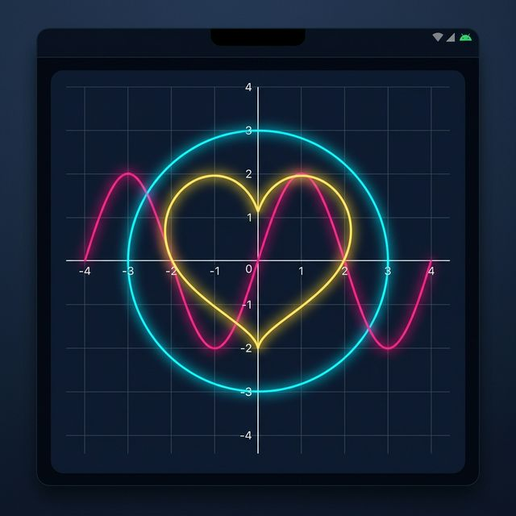

# 📈 eq_visulaization

A powerful and performant Flutter package for visualizing multiple mathematical equations simultaneously with beautiful animations and customizable coordinate systems.

---

### Language Switch / ভাষা পরিবর্তন
**[English](#english) | [বাংলা](#bangla)**

---

<div id="english">

## 🇬🇧 English Documentation

[](assets/preview.png)

### Features

- ✅ **Multi-equation Support**: Render multiple functions on a single canvas.
- ✅ **Dynamic Animations**: Choose from `radial`, `sequential`, `linearX`, or `linearY` animation styles.
- ✅ **Customizable Coordinate System**: Toggle grids/axes, change colors, and adjust stroke widths.
- ✅ **Origin Alignment**: Position the origin (0,0) anywhere (e.g., Center, BottomLeft for 1st Quadrant).
- ✅ **High Performance**: Optimized using `Float32List` and `drawRawPoints` for smooth frame rates.

### 🚀 Getting Started

Add the package to your `pubspec.yaml`:

```yaml
dependencies:
  eq_visulaization:
    path: ../eq_visulaization # Use local path or git URL
```

### 💡 Usage

```dart
import 'package:eq_visulaization/eq_visulaization.dart';

// ... inside your widget tree
EquationPainterWidget(
  width: 400,
  height: 400,
  alignment: Alignment.center,
  equations: [
    EquationConfig(
      function: (x, y) => x * x + y * y - pow(100, 2), // x^2 + y^2 = 100^2
      color: Colors.cyanAccent,
      strokeWidth: 3,
      animationType: AnimationType.radial,
    ),
    EquationConfig(
      function: (x, y) => y - 50 * sin(x / 20), // y = 50 * sin(x/20)
      color: Colors.pinkAccent,
      strokeWidth: 2,
      animationType: AnimationType.linearX,
    ),
  ],
)
```

### 🛠 API Reference

#### `EquationPainterWidget`
| Property | Type | Default | Description |
|---|---|---|---|
| `equations` | `List<EquationConfig>` | **Required** | List of equations to draw. |
| `width`/`height` | `double` | `300` | Canvas dimensions. |
| `showGrid`/`showAxis`| `bool` | `true` | Toggle coordinate helpers. |
| `animate` | `bool` | `true` | Enable/disable entry animation. |
| `animationType` | `AnimationType` | `radial` | Default animation style for equations. |
| `alignment` | `Alignment` | `center` | Where the (0,0) point is located. |

#### `EquationConfig`
| Property | Type | Description |
|---|---|---|
| `function` | `MathFunction` | `(x, y) => double` form of the equation `f(x,y) = 0`. |
| `color` | `Color` | Color of the curve. |
| `strokeWidth` | `double` | Width of the curve line. |
| `animationType` | `AnimationType?` | Overrides widget default for this specific curve. |

#### `AnimationType`
- `radial`: Revealed from center out.
- `sequential`: Hand-drawn effect (follows the curve path).
- `linearX`: Revealed left to right.
- `linearY`: Revealed top to bottom.

---

</div>

<div id="bangla">

## 🇧🇩 বাংলা ডকুমেন্টেশন

### বৈশিষ্ট্যসমূহ

- ✅ **একাধিক সমীকরণ সমর্থন**: একটি একক ক্যানভাসে একাধিক ফাংশন রেন্ডার করুন।
- ✅ **ডায়নামিক অ্যানিমেশন**: `radial`, `sequential`, `linearX`, অথবা `linearY` অ্যানিমেশন স্টাইল থেকে বেছে নিন।
- ✅ **কাস্টমাইজযোগ্য কোঅর্ডিনেট সিস্টেম**: গ্রিড/অক্ষ (Axes) অন-অফ করা, রং পরিবর্তন এবং স্ট্রোক উইডথ অ্যাডজাস্ট করা যায়।
- ✅ **অরিজিন অ্যালাইনমেন্ট**: অরিজিন (০,০) যেকোনো স্থানে স্থাপন করা যায় (যেমন: ১ম কোয়াড্র্যান্টের জন্য BottomLeft)।
- ✅ **উচ্চ পারফরম্যান্স**: মসৃণ ফ্রেম রেটের জন্য `Float32List` এবং `drawRawPoints` ব্যবহার করে অপ্টিমাইজ করা হয়েছে।

### 🚀 শুরু করা যাক

আপনার `pubspec.yaml`-এ প্যাকেজটি যোগ করুন:

```yaml
dependencies:
  eq_visulaization:
    path: ../eq_visulaization
```

### 💡 ব্যবহার পদ্ধতি

```dart
import 'package:eq_visulaization/eq_visulaization.dart';

// ... আপনার উইজেট ট্রির ভেতরে
EquationPainterWidget(
  width: 400,
  height: 400,
  alignment: Alignment.center,
  equations: [
    EquationConfig(
      function: (x, y) => x * x + y * y - pow(100, 2), // x^2 + y^2 = 100^2
      color: Colors.cyanAccent,
      strokeWidth: 3,
      animationType: AnimationType.radial,
    ),
    EquationConfig(
      function: (x, y) => y - 50 * sin(x / 20), // y = 50 * sin(x/20)
      color: Colors.pinkAccent,
      strokeWidth: 2,
      animationType: AnimationType.linearX,
    ),
  ],
)
```

### 🛠 এপিআই রেফারেন্স (API Reference)

#### `EquationPainterWidget`
| প্রপার্টি | টাইপ | ডিফল্ট | বর্ণনা |
|---|---|---|---|
| `equations` | `List<EquationConfig>` | **প্রয়োজনীয়** | আঁকার জন্য সমীকরণের তালিকা। |
| `width`/`height` | `double` | `300` | ক্যানভাসের আকার। |
| `showGrid`/`showAxis`| `bool` | `true` | গ্রিড এবং অক্ষ দেখানো বা লুকানো। |
| `animate` | `bool` | `true` | অ্যানিমেশন চালু বা বন্ধ করা। |
| `animationType` | `AnimationType` | `radial` | সমীকরণের জন্য ডিফল্ট অ্যানিমেশন স্টাইল। |
| `alignment` | `Alignment` | `center` | (০,০) বিন্দুটি কোথায় অবস্থিত হবে। |

#### `EquationConfig`
| প্রপার্টি | টাইপ | বর্ণনা |
|---|---|---|
| `function` | `MathFunction` | সমীকরণের `f(x,y) = 0` রূপ। |
| `color` | `Color` | রেখার রং। |
| `strokeWidth` | `double` | রেখার পুরুত্ব। |
| `animationType` | `AnimationType?` | নির্দিষ্ট এই রেখার জন্য অ্যানিমেশন স্টাইল ওভাররাইড করে। |

#### `AnimationType` (অ্যানিমেশন টাইপ)
- `radial`: কেন্দ্র থেকে বাইরের দিকে প্রকাশ পায়।
- `sequential`: হাতের ড্রয়িং এফেক্ট (কার্ভ বরাবর এগিয়ে যায়)।
- `linearX`: বাম থেকে ডানে প্রকাশ পায়।
- `linearY`: উপর থেকে নিচে প্রকাশ পায়।

---

</div>

## 📄 License

This project is licensed under the MIT License - see the [LICENSE](LICENSE) file for details.

## 🤝 Contributing

Contributions are welcome! Feel free to open issues or submit pull requests.

---
**Crafted with ❤️ for Mathematicians and Developers.**
